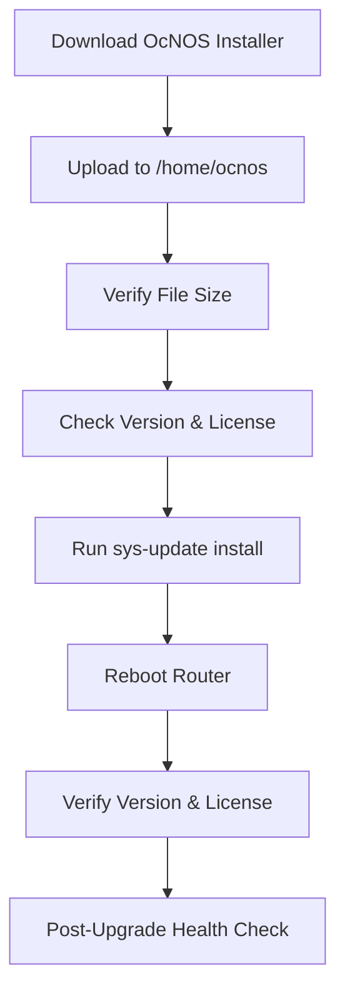

# OcNOS Software Upgrade Guide

> A practical, operator-friendly runbook for **upgrading or downgrading IP Infusion OcNOS** using the built-in `sys-update` workflow.

---

## ✨ Overview

This guide covers the basic operational flow to:

- Download the correct OcNOS installer
- Transfer the image to the router
- Verify the file integrity by comparing file size
- Record the current software version and license
- Install the new OcNOS image
- Reboot the router
- Perform post-upgrade verification

> **⚠️ Important:** Always confirm the installer matches the exact platform, product edition, and upgrade path supported by your OcNOS release notes before starting a maintenance window.

---

## 🧭 Upgrade Flow



---

## 1. 📥 Download the OcNOS Installer

Download the required OcNOS installer from the appropriate vendor/software portal.

Example:

```text
OcNOS-SP-MPLS-Q2-7.0.2-9-MR-installer
```

Before proceeding, verify that the image is intended for the target router and that the release is supported by the vendor's upgrade documentation.

---

## 2. 📤 Upload the Installer to the Router

Upload the installer to:

```text
/home/ocnos
```

Use **SFTP** or **SCP** from your workstation.

### SCP example

```bash
scp OcNOS-SP-MPLS-Q2-7.0.2-9-MR-installer \
    <username>@<router-management-ip>:/home/ocnos/
```

### SFTP example

```bash
sftp <username>@<router-management-ip>
```

Then:

```text
cd /home/ocnos
put OcNOS-SP-MPLS-Q2-7.0.2-9-MR-installer
```

---

## 3. 🔎 Verify the Installer

After uploading the installer, log in to the router and verify that the file exists.

Enter enable mode:

```bash
enable
```

Check the current directory:

```bash
pwd
```

List the files:

```bash
ls -l
```

### File size verification

Compare the installer size shown on the router with the **official downloaded package**.

Example:

```text
Router:
-rw-r--r--  1 ocnos ocnos  XXXXXXXX  OcNOS-SP-MPLS-Q2-7.0.2-9-MR-installer

Expected:
XXXXXXXX bytes
```

The file size should match the source package.

> **Best practice:** When the vendor provides SHA-256/MD5 checksums, prefer checksum verification over file-size comparison because a matching size alone does not prove file integrity.

---

## 4. 🧾 Record Current Version & License

Before changing the software, capture the current state.

### Software version

```bash
show version
```

### License

```bash
show license
```

Save the output as part of the maintenance record.

Example baseline:

```text
+----------------+------------------+
| Item           | Before Upgrade   |
+----------------+------------------+
| Software       | <current-version>|
| Target         | <target-version> |
| License        | Verified         |
| Installer      | Verified         |
+----------------+------------------+
```

---

## 5. 🚀 Run the OcNOS Software Update

Use the installer from `/home/ocnos`.

Example:

```text
OcNOS# sys-update install file:///home/ocnos/OcNOS-SP-MPLS-Q2-7.0.2-9-MR-installer
```

The exact installer filename must match the file you uploaded.

### What this step does

Conceptually:

```text
Installer
   │
   ▼
sys-update install
   │
   ├── Validate / prepare image
   ├── Install software
   └── Mark new software for boot
```

Monitor the command output carefully and do not interrupt the process unless the platform/vendor documentation explicitly instructs you to do so.

---

## 6. 🔄 Reboot the Router

After the software update completes successfully, reboot the router according to the OcNOS operational procedure for your platform.

> **⚠️ Maintenance impact:** The reboot causes a service interruption. Make sure you have console/OOB access and an approved maintenance window.

A typical operational sequence is:

```text
Upgrade complete
      ↓
Confirm command returned successfully
      ↓
Reboot router
      ↓
Wait for system to return
```

---

## 7. ✅ Post-Upgrade Verification

After the router is reachable again, verify the software and operational state.

### Version

```bash
show version
```

Confirm the expected target release is running.

### License

```bash
show license
```

Confirm the license state remains valid.

### Recommended additional checks

For a production router, also verify the services relevant to your deployment, for example:

```bash
show interface
show ip route
```

For MPLS deployments, run the relevant MPLS/LDP/BGP checks used in your network.

---

# 🧪 Upgrade Checklist

Use this checklist before closing the maintenance window:

| Check | Status |
|---|:---:|
| Correct OcNOS image downloaded | ☐ |
| Platform / release compatibility checked | ☐ |
| Installer uploaded to `/home/ocnos` | ☐ |
| File size / checksum verified | ☐ |
| Current `show version` captured | ☐ |
| Current `show license` captured | ☐ |
| `sys-update install` completed successfully | ☐ |
| Router rebooted successfully | ☐ |
| Target version verified | ☐ |
| License verified | ☐ |
| Interfaces / routing verified | ☐ |
| MPLS / LDP / BGP verified where applicable | ☐ |
| Monitoring / alarms verified | ☐ |

---

# 🛠️ Troubleshooting

## Installer not found

Check:

```bash
pwd
ls -l
```

Confirm the file is present under:

```text
/home/ocnos
```

---

## File size does not match

Do **not** continue with the installation.

Re-transfer the image and verify again.

If a vendor checksum is available, validate it before installation.

---

## `sys-update install` fails

Capture:

1. The complete command output
2. Current `show version`
3. `show license`
4. Installer filename and size
5. Relevant system logs / alarms

Then compare the failure with the release-specific OcNOS documentation.

---

## Router does not return after reboot

Use **console/OOB** access and collect boot messages.

Avoid repeated reboot attempts until the boot state and available recovery procedure are understood.

---

# 📌 Operational Notes

### 1. Keep the old image available

Do not remove the previous software/recovery image until the new release has been validated and the maintenance window is officially closed.

### 2. Keep a pre-change record

At minimum, save:

```text
show version
show license
```

You can also capture routing, interface, MPLS, and BGP state before the upgrade for easier comparison afterwards.

### 3. Upgrade vs Downgrade

The same general `sys-update` workflow may be used for different software transitions, but **supported upgrade/downgrade paths are release-specific**. Always check the applicable OcNOS release documentation first.

---

# 📚 References

- **IP Infusion OcNOS Documentation:** consult the documentation package corresponding to the exact OcNOS release and hardware platform.
- **Software Portal / FlexNet:** use the official installer and checksum information provided for your account/release.
- **OcNOS CLI:** `sys-update install` is the operational command used in this workflow.

---

## 🧩 Quick Command Reference

```bash
# Enter privileged mode
enable

# Check location
pwd

# Check uploaded image
ls -l

# Current software
show version

# Current license
show license

# Install new image
sys-update install file:///home/ocnos/<ocnos-installer>

# After reboot
show version
show license
```

---

<div align="center">

### 🚀 Upgrade carefully. Verify everything. Document the result.

</div>
